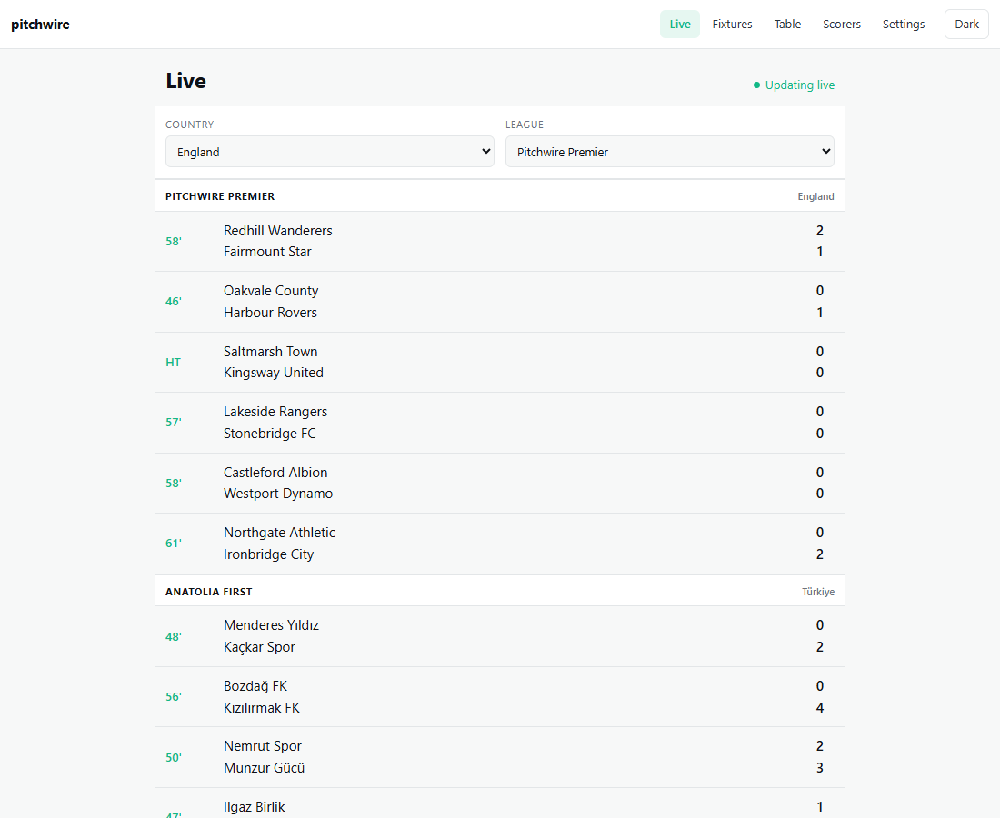
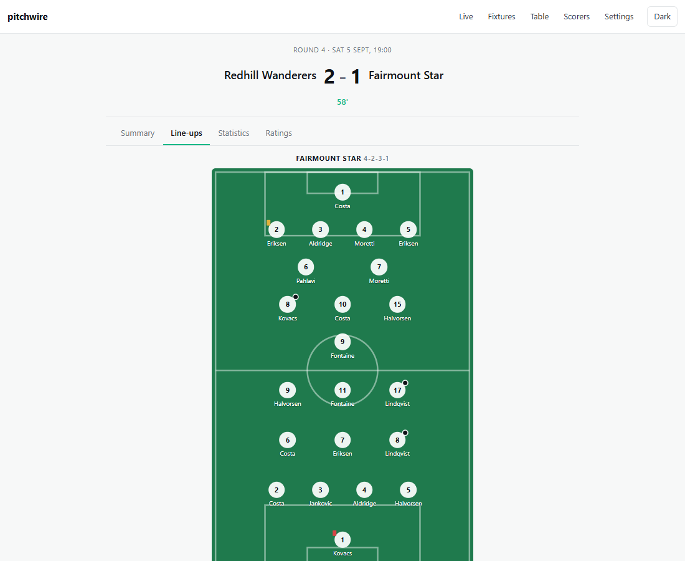

<h1 align="center">pitchwire</h1>

<p align="center">Live football scores, from an unreliable feed to a phone, without lying to anybody on the way.</p>

---

A live score service is a small product with a hard middle. The screens are simple: a list of matches,
a timeline, a table. What is difficult is everything between a provider that drops, duplicates and
reorders events and a reader who will notice immediately if the score is wrong.

This repository is that middle, built properly, with the two ends attached so it can be run and
watched rather than described.

```
docker compose up -d --build --wait
```

Then open <http://localhost:5082>. Matches are being played as you open it.

<p align="center">
  
  
</p>

## What it does

**Takes an untrustworthy feed seriously.** The provider is a separate process that signs every batch
and misbehaves on purpose: it drops events, sends them twice, sends them out of order and goes quiet
mid match. The API deduplicates with a unique index rather than a read before a write, rebuilds a
match from its whole log when something arrives late, notices holes in the sequence and pulls the
missing events back, and finishes matches whose final whistle never arrived.

**Tells a reader when it does not know.** A match with an unfilled gap says so on the page. The
alternative is a score that is quietly wrong, which is the only defect in this product that nobody
can work around.

**Gets a goal to a closed tab.** Deltas go to open clients over SignalR; anybody following a team gets
a web push through a transactional outbox, in their own time zone, subject to their quiet hours.

**Shows the match, not just the score.** A timeline that reads like a report, both team sheets drawn
on a pitch, per side statistics, and a rating for every player who was on long enough to judge. Every
one of those numbers is derived from the event log, so the page and the timeline cannot disagree.

Fixtures and finished results follow the selected league. Both lists group matches by local date and
follow the server's continuation links when there is more to show. A round and a team can be selected
together; the available choices come from the season's stored schedule.

## The stack

.NET 10 and C# 14 on the server, four projects with the dependency arrow pointing inward and a test
that fails the build if it ever points the other way. PostgreSQL 18 through EF Core 10, with the
persistence port shaped like a `DbContext` rather than a repository, and the reason for that written
down. Redis behind `HybridCache`. Vue 3.5, Vite 8 and TypeScript in strict mode on the client, with
every response parsed by a Zod schema at the boundary and type level assertions that those schemas
still match the OpenAPI document the server generates.

No component library. Nothing in the bundle that a screen here does not use.

## Measurements

Everything below was measured on this machine, and the commands that produce the numbers are in the
repository. A performance claim without its hardware is not a claim.

> Intel Core Ultra 7 255H, 16 logical cores, Windows 11 26100, .NET SDK 10.0.401, runtime 10.0.12,
> PostgreSQL 18 and Redis in Docker on the same machine.

**The read API under load**, from `bench/load/read-api.js`, 50 virtual users for 70 seconds while the
feed was ingesting a full round of 31 matches:

| | |
|---|---|
| Requests | 4,906 at 69/s, none failed |
| Live list | 3.15 ms median, 6.3 ms at p95 |
| Match detail | 7.6 ms median, 16.5 ms at p95 |
| Everything | 3.4 ms median, 11.2 ms at p95 |

**The work a match page does**, from `bench/Pitchwire.Benchmarks`:

| | 20 events | 200 events |
|---|---|---|
| Rebuild a match from its whole log | 50 ns, 176 B | 469 ns, 176 B |
| Build both team sheets with ratings | 7.1 µs | 11.6 µs |
| Minutes played from the log | 1.3 µs | 3.8 µs |

The rebuild number is the one that matters, because it is what makes the ordering policy affordable:
an event arriving late replays the entire match rather than being patched into the totals, and that
replay costs less than the query that fetched the events.

Sheet assembly used to cost 33.4 µs at 200 events. It counted the log once per player, which is fine
for eleven names and wasteful for thirty six. Counting once for everybody took it to 11.6 µs. The
benchmark is why that was worth doing and how much it was worth.

**The boundary**, same project: signing a batch costs 320 ns for one event and 3.5 µs for two hundred,
verifying one costs 420 ns and 3.2 µs, and a continuation token is 154 ns to encode and 240 ns to
decode.

**The client**: 46.6 kB gzipped against a 200 kB budget that CI enforces.

**The tests**: 81 unit, 70 integration against a real PostgreSQL in Testcontainers, 46 component and
unit tests in the web project, and two Chromium journeys against the running stack. Five CI jobs,
including one that asserts a match finished with a real event log and takes a browser through the
competition picker, filters and match details.

## Reading the repository

```
src/api/        Domain, Application, Infrastructure, Api
src/feed/       The provider simulator, its own process
src/shared/     The wire contract the two agree on
src/Pitchwire.Web  The Vue application
tests/          Unit, integration, and the support they share
bench/          BenchmarkDotNet and the k6 load test
tools/          The licence audit, which depends on nothing
docs/adr/       Thirteen decisions, each naming what it beat
```

- [docs/requirements.md](docs/requirements.md) — what was being built and why, written before it was.
- [docs/adr](docs/adr/) — the decisions that would be expensive to reverse.
- [docs/operations.md](docs/operations.md) — how to run it, what every setting does, and what to look
  at when it misbehaves.
- [docs/api.http](docs/api.http) — every read endpoint, by hand. The same shape is browsable at
  <http://localhost:5080/scalar/v1> while the stack is up.
- [CHANGELOG.md](CHANGELOG.md) — what landed and when.

## Known limitations

Written down because they are choices.

- **One API instance.** The SignalR hub holds connections in process and cache tag invalidation does
  not reach another instance's first level cache, which was measured rather than assumed.
  [ADR 0008](docs/adr/0008-single-instance.md) says what a second instance would need.
- **Favourites live on one device.** There are no accounts, so there is nothing to recover them with.
  That is the price of holding no personal data.
- **The feed plays one season and stops.** Ten to fifteen minutes of football, then a finished league
  with a table, results and a scorers list. `docker compose down -v` starts a new one.
- **Ratings are a simple model, not an opinion.** A goalkeeper who conceded three in a win comes out
  below a striker who did nothing. [ADR 0012](docs/adr/0012-player-ratings-from-the-log.md) says what
  it would take to do better and why that data is not here.
- **Every club, league and player is invented.** The countries are real. Real clubs would put somebody
  else's trademarks in a demo.

## Licence

MIT. Every dependency, on both sides, is permissively licensed and a CI job proves it on every push.
